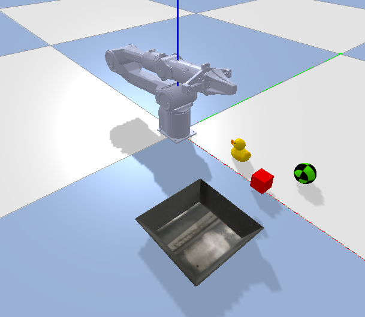

# General Bionix Grasping Example

This repository demonstrates a pipeline for predicting and executing robot grasps using a PyBullet simulation environment and the General Bionix API for point cloud processing and grasp planning.




## Running the Example

**Prerequisites:**


```bash
conda create -n grasp_example python=3.10
conda activate grasp_example
pip install -r requirements.txt
```

**Running the point + click grasp example:**


Add your API key and specify your OS ("MAC" or "LINUX") in the `API_KEY` and `OS` variables at the top of `grasp_example.py`.


```bash
python grasp_example.py
```
After running the command, a PyBullet simulation window will pop up, and an image from the camera's perspective will be displayed. Click on an object in this display (except the tray which is fixed) then close the image display. The service will then return grasp predictions so watch the robot grasp the object and place it in the tray!


**Running the GPT-4o grasp agent example:**

Add your API key to the `API_KEY` variable at the top of `agent_example.py`.

```bash
export OPENAI_API_KEY="<Insert your OpenAI key>"
python agent_example.py
```

This is an example of how to build a VLM agent using our API. We construct a visual prompt which is first displayed on the screen then sent to GPT-4o to decide which object to grasp. You can think of this as a reasoning layer above the grasping API that can make high-level plans.  


## Overview

The core components are:

1.  **`sim.py`**: A PyBullet-based simulation environment (`SimGrasp`) that loads a robot, objects, simulates a camera, and provides robot control functionalities.
2.  **`client.py`**: A client (`GeneralBionixClient`) to interact with external microservices for:
    *   Cropping point clouds.
    *   Predicting potential grasps from point clouds.
    *   Filtering grasps based on reachability.
3.  **`grasp_example.py`**: An example script orchestrating the entire pipeline: simulation setup, data acquisition, service calls, visualization, and grasp execution.
4.  **`vis.py`**: Utilities picking points on the image.
5.  **`transform.py`**: Functions for coordinate transformations (e.g., camera frame to robot frame).
6.  **`cameras.py`**: Configuration details for simulated cameras.


## Example Workflow (`grasp_example.py`)

The `grasp_example.py` script demonstrates the end-to-end process:

1.  **Initialization**: Sets up the `SimGrasp` simulation environment and the `GeneralBionixClient`.
2.  **Rendering & Point Cloud**: Renders the scene from the simulated camera and generates an initial Open3D point cloud.
3.  **User Interaction**: Displays the RGB image and uses `vis.ImgClick` to capture the (x, y) pixel coordinates clicked by the user, indicating the region of interest.
4.  **Downsampling**: Reduces the point cloud density for faster processing.
5.  **Crop Point Cloud**: Calls `client.crop_point_cloud` using the clicked coordinates to get a focused point cloud of the object.
6.  **Predict Grasps**: Calls `client.predict_grasps` with the cropped point cloud data. The returned grasps are in the camera's coordinate frame.
7.  **Transform Grasps**: Uses `env.transform_grasps_to_robot_frame` (which internally uses `transform.py`) to convert the predicted grasps from the camera frame to the robot's base frame.
8.  **Filter Grasps**: Calls `client.filter_grasps` with the robot-frame grasps to identify reachable ones.
9.  **Select Grasp**: Chooses the first valid grasp returned by the filtering service.
10. **Execute Grasp**: Converts the chosen grasp pose (rotation matrix to Euler angles) and calls `env.execute_grasp_sequence` to perform the pick-and-lift motion in the simulation.

## Simulation (`sim.py`)

The `sim.py` module provides the `Sim` base class and the `SimGrasp` derived class for the simulation environment.

**Key Features:**

*   Loads a robot from a URDF file.
*   Loads objects (duck, tray, cube by default) into the scene.
*   Configures and renders data (color, depth, segmentation) from a simulated camera (defined in `cameras.py`).
*   Generates Open3D point clouds from camera data.
*   Provides robot control via Inverse Kinematics (`robot_control`).
*   Includes a pre-defined grasp execution sequence (`execute_grasp_sequence`).
*   Handles coordinate transformations between camera and robot frames (`transform_grasps_to_robot_frame`).

**Customization:**

*   **Objects**:
    *   Modify the `add_object` calls within the `SimGrasp.__init__` method in `sim.py`. You can change the URDF file paths, initial positions, orientations, and scaling factors for each object.
    *   Add or remove objects by adding/removing `add_object` calls.
*   **Camera**:
    *   Modify camera properties (pose, intrinsics, resolution, noise) in `cameras.py`.
    *   Select which camera configuration to use by changing which element of `cameras.RealSenseD435.CONFIG` (or another camera class) is accessed in `SimGrasp.__init__` and `render_camera`.
*   **Grasp Execution**:
    *   Modify the sequence of movements (e.g., approach strategy, lift height) within the `execute_grasp_sequence` method in `sim.py`.
    *   Change the robot control parameters (e.g., IK solver settings, joint control forces) in the `robot_control` method.

**Acknowledgements:**

Thank you to the following projects:
- [OWG](https://github.com/gtziafas/OWG)
